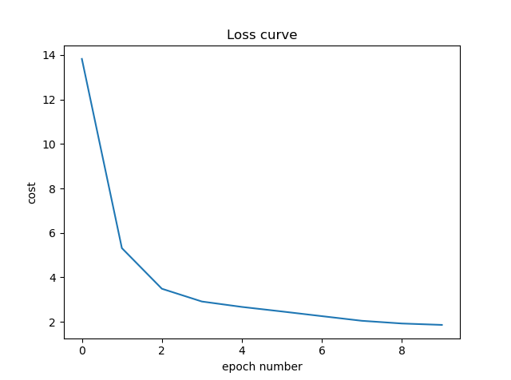
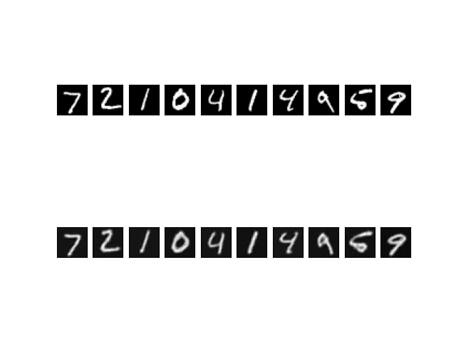
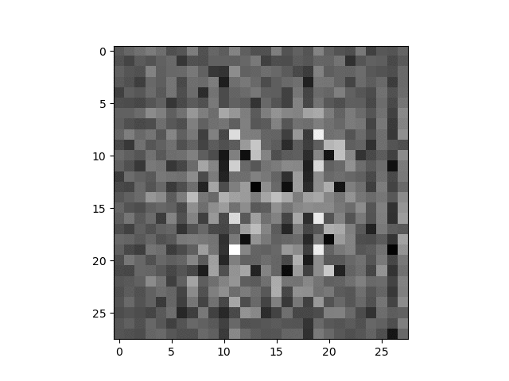
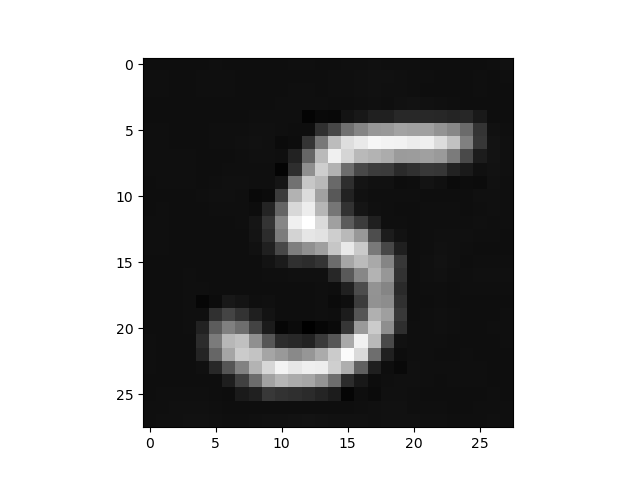

# Variational Autoencoder

A Variational Autoencoder is an autoencoder where we map the fixed bottleneck vector to a distribution.


Loss(Total) =   MSELoss + KLDivLoss

The model contains:
* The low-dimensional code learned for input x in the bottleneck layer is the output of encoder, let's call it z.
* We split 'z' into 2 vectors, the mean vector and the standard deviation vector.
* We then sample a vector of dimension same as the mean and standard deviation. This vector is sampled from the standard Gaussian distribution.
* We multiply this vector with the standard deviation vector and add the mean vector to create a new vector 'w'.
* We then pass the vector 'w' to the decoder.
* We have used ResNet-like layers in the encoder and inverse ResNet-like layers in the decoder.


We have implemented the Variational Autoencoder using PyTorch. You need to install these external libraries before running our code: 
* pytorch(for model training)
* matplotlib(for plotting graphs and images)
* tqdm(for showing progress bars)
* numpy(for displaying images)

Our model has already been trained on the MNIST dataset. To run our code, Open Terminal and navigate to this directory and run:
```
python VAE-ResNET.py
```
You can train a new model from scratch or load our pre-trained model to test.

Hyperparameters used for the Variational Autoencoder Training:

| Parameters|  Values |
| -------- | -------- |
 Learning Rate | 5 x 10<sup>-3</sup>  | 
| Epochs | 10 |
| Loss |(MSE+KLDiv) |  
<br/>

Our Training and Testing Losses were:

| Type | Value |
| -------- | -------- |
| Training Loss | 2.0276 |
| Testing Loss | 1.9304|
<br/>

Our loss function value graph during training:




Our Input and Output on the Test set was:



Our transition of Random generated images:



Our Final Output for randomly generated image:



