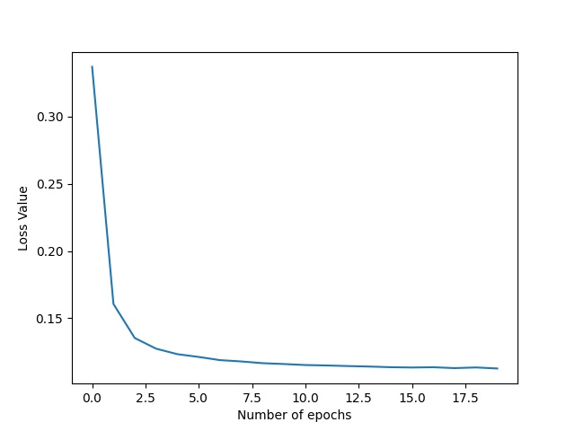

# Contractive Autoencoder

A Contractive Autoencoder is an autoencoder which learns to reproduce the input from a compressed representation of the output of encoder. The encoder's task is to create an efficient representation of the data and extracing useful information from the input. The decoder's task is to recreate the original input from the compressed output(encoding) of the autoencoder. It applies constraints to the encoder network in a way such that the encoder is robust to small perturbations(changes) around the training input. This is done by adding an additional loss by calculating the Frobenius Norm of the Jacobian matrix formed using the encoder function and it's output(i.e the bottleneck layer).

Loss(Total) = Loss(Vanilla) + lambda * (J(encoder function, inputs)<sup>2</sup>)

The model contains:
* An encoder function g(.) parameterized by ϕ
* A decoder function f(.) parameterized by θ
* The low-dimensional code learned for input x in the bottleneck layer is the output of encoder, let's call it y 
* The reconstructed input is z = g<sub>ϕ</sub>(y)

The parameters (θ,ϕ) are learned together to output a reconstructed data sample same as the original input:
<div align='center'> x' = f<sub>θ</sub>(g<sub>ϕ</sub>(x)) </div>

Our target is to get:
<div align='center'> x' ≈ x </div>

We have implemented the Contractive Autoencoder using PyTorch. You need to install these external libraries before running our code: 
* pytorch(for model training)
* matplotlib(for plotting graphs and images)
* tqdm(for showing progress bars)
* numpy(for displaying images)

Our model has already been trained on the MNIST dataset. To run our code, Open Terminal and navigate to this directory and run:
```
python contractive.py
```
You can train a new model from scratch or load our pre-trained model to test.

Hyperparameters used for the Contractive Autoencoder Training:

| Parameters|  Values |
| -------- | -------- |
| Learning Rate | 5 x 10<sup>-3</sup>  | 
| Epochs | 20 |
| Minibatch Size | 600 |
|Lambda | 10<sup>-4</sup> |
| Optimizer | Adam |
| Loss Function | BCE Loss |  
<br/>

Our Training and Testing Losses were:

| Type | Value |
| -------- | -------- |
| Training Loss | 0.1126 |
| Testing Loss | 0.0662|
<br/>

Our Input and Output on the Test set was:


Our loss function value graph during training:


