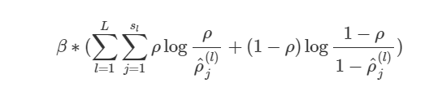
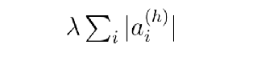
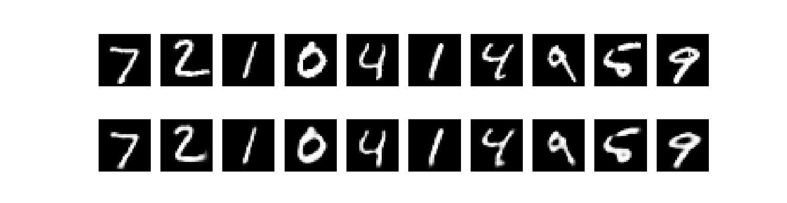
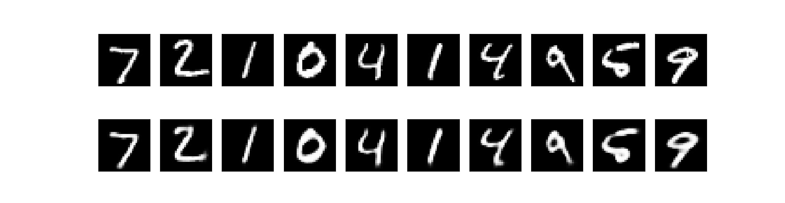
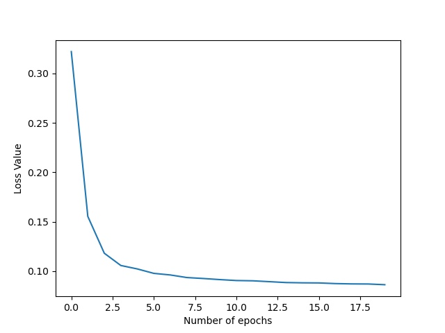
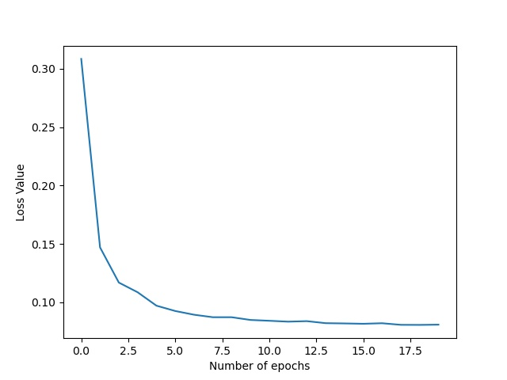

# Sparse Autoencoder

A Sparse Autoencoder is an autoencoder which learns to reproduce the input from a compressed representation of the output of encoder. The encoder's task is to create an efficient representation of the data and extract useful information from the input. The decoder's task is to recreate the original input from the compressed output(encoding) of the autoencoder.
It applies constraints on the activations of the hidden layers so that the network can learn more efficiently and is more robust. It trains the model so that each weight in each hidden layer learns something useful.
This is done by modifying the loss function.

The loss used can be:

1) **Kullback-Liebler Loss**:
   The KL-divergence measures the difference between two Bernoulli distributions, one with mean ρ and the other with mean ρ'<sup>(l)</sup><sub>j</sub>.
   The fraction of activations is expected to be a small number ρ, known as sparsity parameter
   The hyperparameter β controls how strong the penalty we want to apply on the sparsity loss. This is the penalty loss we add in addition to the loss function we use for the training of the network(such as BCELoss, MSELoss etc):

 


2) **L1 Loss** : This adds L1 Sparsity constraint to the activations of the neurons after the ReLU function, this adds sparsity effect to the weights. The hyperparameter λ controls how strong the penalty we want to apply on the sparsity loss. This is the penalty loss we add in addition to the loss function we use for the training of the network(such as BCELoss, MSELoss etc):




The model contains:
* An encoder function g(.) parameterized by ϕ
* A decoder function f(.) parameterized by θ
* The low-dimensional code learned for input x in the bottleneck layer is the output of encoder, let's call it y 
* The reconstructed input is z = g<sub>ϕ</sub>(y)

The parameters (θ,ϕ) are learned together to output a reconstructed data sample same as the original input:
$$
<div align='center'> x' = f<sub>θ</sub>(g<sub>ϕ</sub>(x)) </div>

Our target is to get:
<div align='center'> x' ≈ x </div>

We have implemented the Sparse Autoencoder using PyTorch. You need to install these external libraries before running our code: 
* pytorch(for model training)
* matplotlib(for plotting graphs and images)
* tqdm(for showing progress bars)
* numpy(for displaying images)

Our model has already been trained on the MNIST dataset. To run our code, Open Terminal and navigate to this directory and run:
```
python sparse_l1.py # for L1 Loss as loss function
python sparse_kl.py # for KL Divergence as loss function
```

Hyperparameters used for the KL Divergence Loss Training:

| Parameters|  Values |
| -------- | -------- |
| Learning Rate | 9 x 10<sup>-3</sup>  | 
| Epochs | 20 |
| Minibatch Size | 1200 |
| Optimizer | Adam |
| Loss Function | BCE Loss |
| Sparsity parameter(ρ) | 0.08 |
| Beta | 0.005 |
<br/>

Hyperparameters used for the L1 Loss Training:

| Parameters|  Values |
| -------- | -------- |
| Learning Rate | 9 x 10<sup>-3</sup>  | 
| Epochs | 20 |
| Minibatch Size | 1200 |
| Optimizer | Adam |
| Loss Function | BCE Loss |
| Lambda | 4 x 10<sup>-5</sup> |
<br/>
You can train a new model from scratch or load our pre-trained model to test.

Our Training and Testing Losses were:

| Type | KL Divergence Loss | L1 Loss |
| -------- | -------- | -------- |
| Training Loss | 0.0862 | 0.0809 |
| Testing Loss | 0.0771 | 0.07757 |
<br/>

Our Input and Output on the Test set was:

* KL Divergence Input and Output:



* L1 Input and Output:




Our loss function value graph during training:

* KL Divergence Loss Graph:



* L1 Loss Graph:


