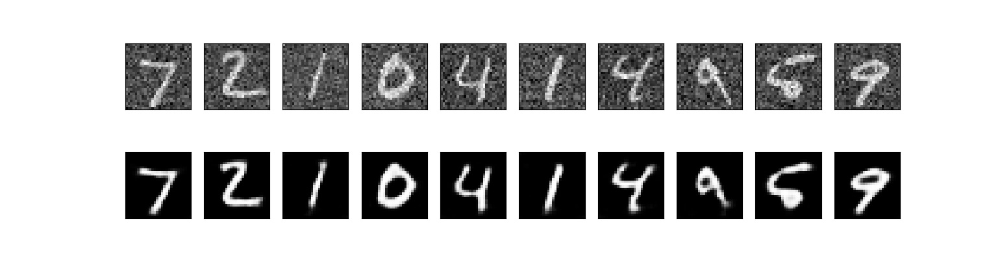
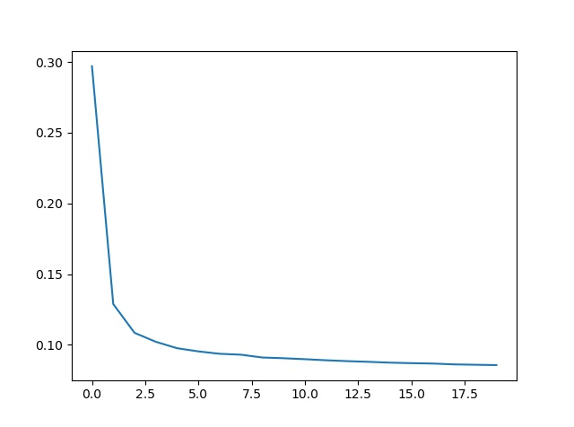

# Denoising Autoencoder

A Denoising Autoencoder is an autoencoder which learns to produce a clean output from a noisy input. The neural network is given noisy images as input for training and is trained to create clean images(in which noise is removed) from the input. The encoder's task is to create an efficient representation of the data while ignoring the noise and extracing useful information from the input. The decoder's task is to create a clean image from the compressed output(encoding) of the autoencoder.

The noise can be of any type. We have added Gaussian noise on our training datasets before training.

<div align='center'> x<sub>noisy</sub> = x + noise_factor * randn()</div>

Here x<sub>noisy</sub> is the noisy input given to autoencoder, x is the original(clean) image from the dataset, noise_factor is a factor which controls the amount of noise, randn() is a function returning random values following a standard normal distribution. We used PyTorch's inbuilt function, "torch.randn_like(input_of_same_size)" for creating the Gaussian noise.

The model contains:
* An encoder function g(.) parameterized by ϕ
* A decoder function f(.) parameterized by θ
* The low-dimensional code learned for input x<sub>noisy</sub> in the bottleneck layer is the output of encoder, let's call it y 
* The reconstructed input is z = g<sub>ϕ</sub>(y)

The parameters (θ,ϕ) are learned together to output a constructed data sample which is a cleaned version of the noisy input:
<div align='center'> x' = f<sub>θ</sub>(g<sub>ϕ</sub>(x<sub>noisy</sub>)) </div>

Our target is to get:
<div align='center'> x' ≈ x </div>

We have implemented the Denoising Autoencoder using PyTorch. You need to install these external libraries before running our code: 
* pytorch(for model training)
* matplotlib(for plotting graphs and images)
* tqdm(for showing progress bars)

Our model has already been trained on the MNIST dataset. To run our code, Open Terminal and navigate to this directory and run:
```
python denoise.py
```
You can train a new model from scratch or load our pre-trained model to test.

Our output on the MNIST Test set was:



Our loss function value graph during training:


