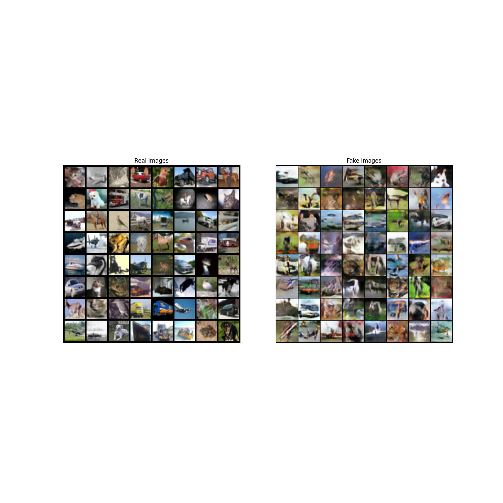
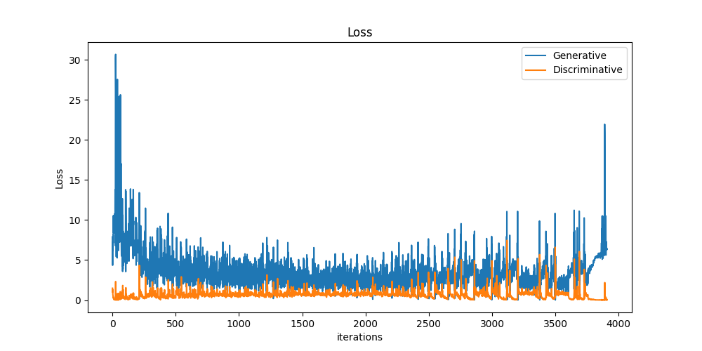

# DCGAN

Deep Convolutional GAN is a a generative adversarial network architecture with the features:
* Replacing any pooling layers with strided convolutions (discriminator) and fractional-strided convolutions (generator).
* Using batchnorm in both the generator and the discriminator.
* Removing fully connected hidden layers for deeper architectures.
* Using ReLU activation in generator for all layers except for the output, which uses tanh.
* Using LeakyReLU activation in the discriminator for all layer.

This model has already been trained on the CIFAR10 dataset. To run the code, Open Terminal and navigate to this directory and run:
```
python DCGAN.py
```
| Parameters|  Values |
| -------- | -------- |
| Learning Rate | 9 x 10<sup>-3</sup>  | 
| Epochs | 20 |
| Minibatch Size | 128 |
| Optimizer | Adam |
| Leaky ReLU slope | 0.2 |
| β1 | 0.5|
| Loss Function | BCE Loss |  
<br/>
Weights initialized with 0 centered Normal distribution with standard deviation = 0.02.

These are the hyperparameters specified in the DCGAN paper and used in training this model.

The ouput is as shown below:


REAL vs Generated images 

The FID score is 80.3. 



The loss is given below:


