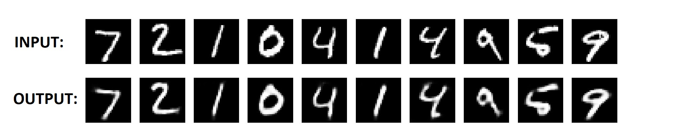
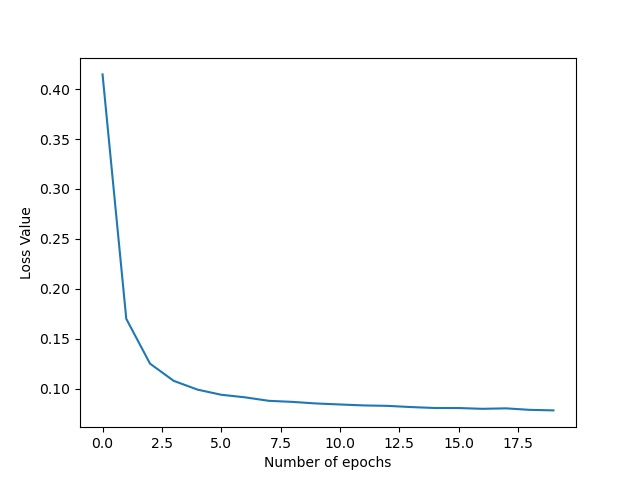

# Vanilla Autoencoder

A Vanilla Autoencoder is an autoencoder which learns to reproduce the input from a compressed representation of the output of encoder. The encoder's task is to create an efficient representation of the data and extracing useful information from the input. The decoder's task is to recreate the original input from the compressed output(encoding) of the autoencoder.

Used for efficient encoding(compression) of data.
The model contains:
* An encoder function g(.) parameterized by ϕ
* A decoder function f(.) parameterized by θ
* The low-dimensional code learned for input x in the bottleneck layer is the output of encoder, let's call it y 
* The reconstructed input is z = g<sub>ϕ</sub>(y)

The parameters (θ,ϕ) are learned together to output a reconstructed data sample same as the original input:
<div align='center'> x' = f<sub>θ</sub>(g<sub>ϕ</sub>(x)) </div>

Our target is to get:
<div align='center'> x' ≈ x </div>

We have implemented the Vanilla Autoencoder using PyTorch. You need to install these external libraries before running our code: 
* pytorch(for model training)
* matplotlib(for plotting graphs and images)
* tqdm(for showing progress bars)

Our model has already been trained on the MNIST dataset. To run our code, Open Terminal and navigate to this directory and run:
```
python vanilla.py
```
You can train a new model from scratch or load our pre-trained model to test.

Our output on the MNIST Test set was:



Our loss function value graph during training:


